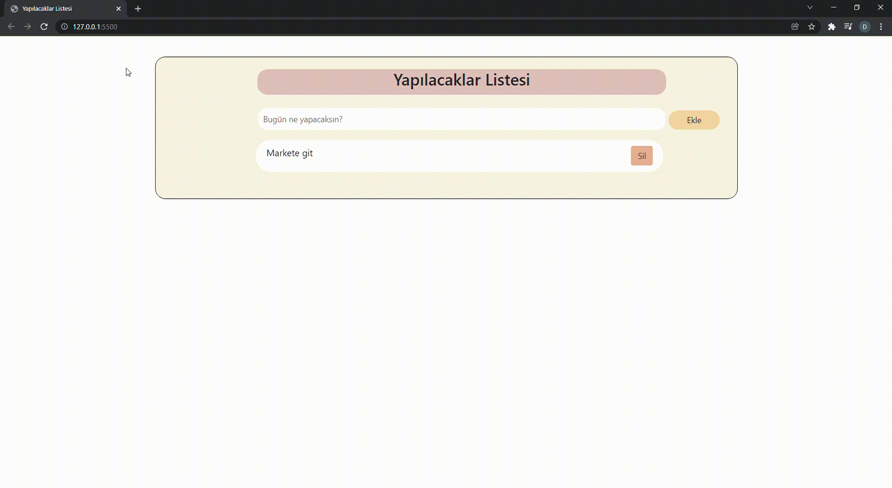

# Javascript Kullanarak TODO-List Yapımı

* Js kullanarak dinamik bir todo list yapılmıştır. Bir metin kutusu ile yapılacak girildiğinde ve ekleme butonuna basıldığında Local Storage'a kaydedilmesi ve dinamik bir listede görünmesi sağlanmıştır. 
* Bir metin yazıldığında Toast bildirimi ile metnin eklendiği belirtilmiştir.
* Ayrıca metin kutusunda herhangi bir şey yazılmadığında bir Toast bildirimi ile herhangi bir şeyin yazılmadığı belirtilmiş ve ekleme işlemi yapılmaması sağlanmıştır.
* Listedeki her bir ögenin yanına yerleştirilen silme butonu ile ögenin hem listeden hem de Local Storage içerisinden silinmesi sağlanmıştır.
* Listedeki ögelerden birisine tıklandığında ögenin yanına tik işareti konulmuş ve başka bir renkle yapıldığı belirtilmiştir. Tekrar tıklandığında ise eski haline dönmesi sağlanmıştır.

